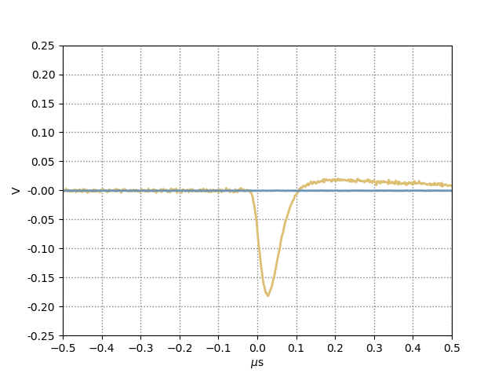

# Tektronix serial port DAQ

## Description

DAQ software for Tektronix scope TDS 3052 scope, with RS 232 connection.

## Requirements

These python libraries are required:

* pyvisa
* matplotlib
* numpy

To install pyvisa with the backend, use

    pip install pyvisa-py
 

If pyroot is installed, data will be saved to root files. If not, data will be saved as text files

You will need to be able to access serial ports on your machine. This can be done by changing the permissions on /dev/tty<port> so that anyone chan change access them:

    sudo chmod o+rw /dev/tty<port>

or by adding yourself to the 'dialout' group on your machine:

    sudo usermod -a -G dialout <username>

you will have to restart for this to take effect.

## Usage

    usage: Read data from a Tektronix TDS 3052 oscilloscpe via an RS-232 port
           [-h] [-p PORT] [-r BAUDRATE] [-u] [--nosave] [-o FILE] [-n NEVENTS]
           [-k] [-w CH] [-l LENGTH] [-c CH] [-t TRIG_LEVEL] [-s TRIG_SLOPE]
           [--vsca1 VSCALE] [--vsca2 VSCALE] [--coupl1 COUPL] [--coupl2 COUPL]
           [--imped1 IMPED] [--imped2 IMPED] [-b HSAMP] [-pt PRETRIGGER]

    optional arguments:
      -h, --help            show this help message and exit
      -p PORT, --port PORT  The port to listen to
      -r BAUDRATE, --baudrate BAUDRATE
                            baud rate of port
      -u, --unlock          Unlock front panel then exit
      --nosave              Don't save data
      -o FILE, --output FILE
                            Name of data file
      -k, --keep            Keep existing scope settings, ignoring other command
                            line arguments.
      -w CH, --wave CH      Record waveform data for channel CH; specify 'a' for
                            all channels.
      -l LENGTH, --length LENGTH
                            Specify the waveform recordlength; not independent of
                            the time base. Allowed values are: 5.E2 and 1.E4
      -n NEVENTS, --nevents NEVENTS
                            Number of events to record
      -c CH, --trsrc CH     Specify the trigger channel; specify '0' for 'EXT'
      -t TRIG_LEVEL, --trlevel TRIG_LEVEL
                            Specify trigger level (in volts).
      -s TRIG_SLOPE, --trslope TRIG_SLOPE
                            Specify the trigger edge slope - FALL or RISE.
      --vsca1 VSCALE        Specify vertical scale (in volts) for channel 1.
      --vsca2 VSCALE        Specify vertical scale (in volts) for channel 2.
      --coupl1 COUPL        Specify coupling for channel 1, 'AC' or 'DC'; default
                            is 'DC'.
      --coupl2 COUPL        Specify coupling for channel 2.
      --imped1 IMPED        Specify impedance for channel 1, 'FIF' or 'MEG';
                            default is 'MEG'.
      --imped2 IMPED        Specify impedance for channel 2.
      -b HSAMP, --hsamp HSAMP
                            Specify the horizontal scale (in seconds); note that
                            this can effect the sample rate.
      -pt PRETRIGGER, --pretrigger PRETRIGGER
      	  	            Specify the amount of pretrigger (percent).

